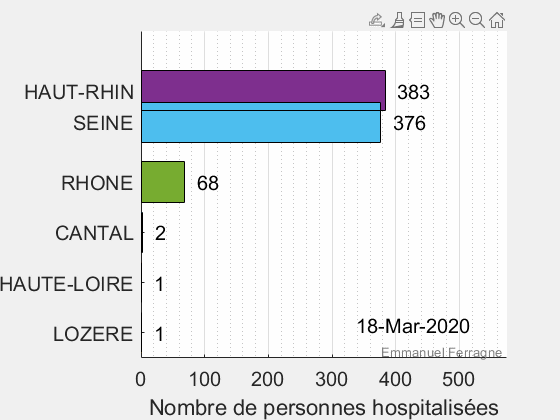

+++
title = "Données COVID"
subtitle = "Quelques visualisations"

date = 2020-03-25T00:00:00
lastmod = 2020-03-25T00:00:00
draft = false

# Authors. Comma separated list, e.g. `["Bob Smith", "David Jones"]`.
authors = ["Admin"]

tags = ["Data Science"]
summary = "Quelques visualisations"
[image]
  # Caption (optional)
  #caption = "Photo by Vlah Dumitru on Unsplash"

  # Focal point (optional)
  # Options: Smart, Center, TopLeft, Top, TopRight, Left, Right, BottomLeft, Bottom, BottomRight
  focal_point = ""

  # Show image only in page previews?
  preview_only = false

+++

La crise que nous traversons est aussi l'occasion de mettre à profit de nombreuses techniques de visualisations des données et de *machine learning*. La représentation ci-dessous montre le nombre d'hospitalisations liées au COVID-19 par jour dans 3 départements très touchés et 3 départements peu touchés. Les données de Santé publique France que j'ai utilisées sont téléchargeables [ici] (https://www.data.gouv.fr/fr/datasets/donnees-hospitalieres-relatives-a-lepidemie-de-covid-19/).

