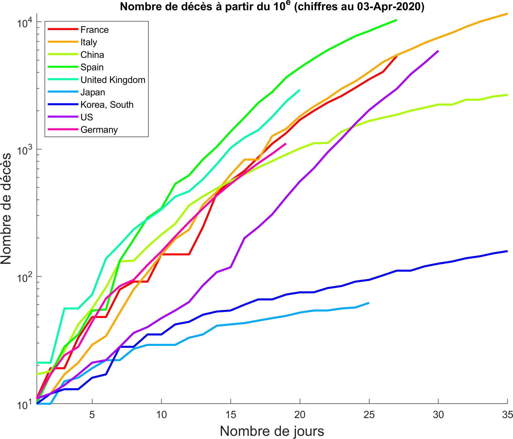
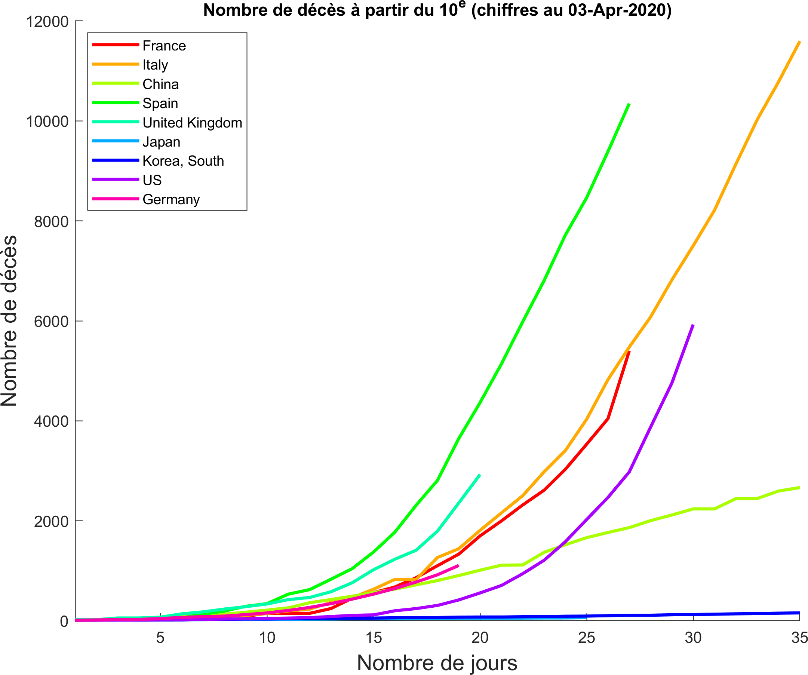

+++
title = "Données COVID"
subtitle = "Quelques visualisations"

date = 2020-03-25T00:00:00
lastmod = 2020-03-25T00:00:00
draft = false

# Authors. Comma separated list, e.g. `["Bob Smith", "David Jones"]`.
authors = ["Admin"]

tags = ["Data Science"]
summary = "Quelques visualisations"
[image]
  # Caption (optional)
  #caption = "Photo by Vlah Dumitru on Unsplash"

  # Focal point (optional)
  # Options: Smart, Center, TopLeft, Top, TopRight, Left, Right, BottomLeft, Bottom, BottomRight
  focal_point = ""

  # Show image only in page previews?
  preview_only = false

+++

La crise que nous traversons est aussi l'occasion de mettre à profit de nombreuses techniques de visualisations des données et de *machine learning*.  Les données de Santé publique France que j'ai utilisées sont téléchargeables [ici] (https://www.data.gouv.fr/fr/datasets/donnees-hospitalieres-relatives-a-lepidemie-de-covid-19/). La représentation ci-dessous montre le nombre (cumulé) d'hospitalisations liées au COVID-19 par jour et par région :

L'animation suivante montre le nombre d'hospitalisations par jour liées au COVID-19 dans 3 départements très touchés et 3 départements peu touchés (choisir la vue 'Ranks' pour mieux voir ces derniers) :

C'est aussi l'occasion de se souvenir du principe d' **intégrité graphique** d'Edward Tufte et de garder à l'esprit qu'un graphique, sans que l'intention soit malhonnête, peut déformer notre perception des données. Je reproduis ci-dessous un graphique montrant le nombre de décès du Covid-19 (à partir du moment où le 10e décès est survenu) dans les 9 pays les plus touchés réalisé à partir des données de l'[Université John Hopkins] (https://data.humdata.org/dataset/novel-coronavirus-2019-ncov-cases). Cette représentation m'a frappé car elle montrait le cas de la France dans le tiers supérieur, non loin de l'Italie, alors que les chiffres sont très différents (FR: 4043 IT: 13155 en date du 2 avril 2020). L'échelle logarithmique "écrase" par définition les valeurs élevés mais en contrepartie permet de mieux distinguer les courbes des pays ayant des valeurs plus basses. 

A l'inverse, la même figure avec une échelle linéaire reflète plus fidèlement les chiffres bruts :

On y voit clairement qu'il y a 3 fois plus de décès en Italie qu'en France. Linéaire ou logarithmique, chaque version est un compromis. Comme dans de nombreux domaines de la perception humaine, l'échelle logarithmique se rapproche peut-être davantage de la manière dont nous percevons ces chiffres. 

