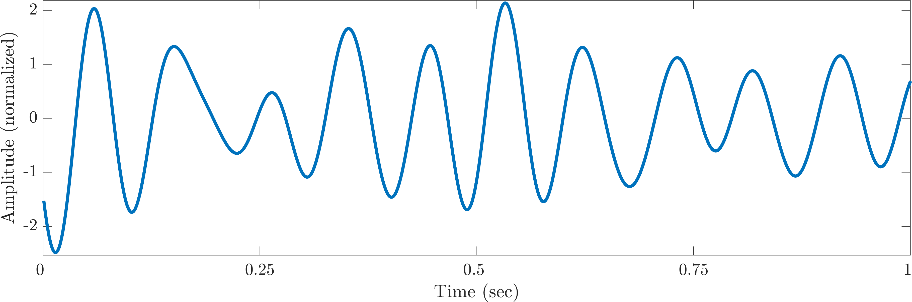
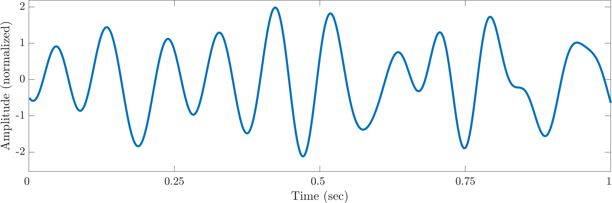
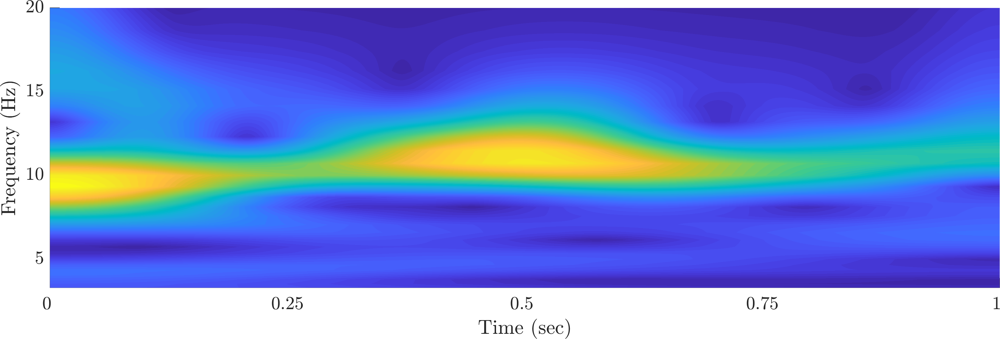
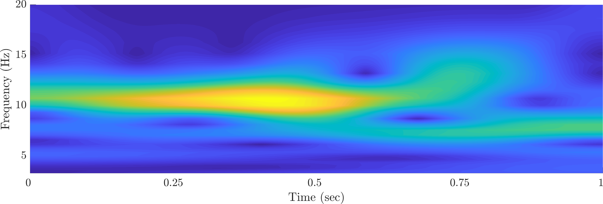

+++
# Project title.
title = "EEGino Pi"

# Date this page was created.
date = 2019-03-07T00:00:00

# Project summary to display on homepage.
summary = "Low-cost EEG for research"

# Tags: can be used for filtering projects.
# Example: `tags = ["machine-learning", "deep-learning"]`
tags = ["Research", "EEG"]

# Optional external URL for project (replaces project detail page).
external_link = ""

# Slides (optional).
#   Associate this project with Markdown slides.
#   Simply enter your slide deck's filename without extension.
#   E.g. `slides = "example-slides"` references 
#   `content/slides/example-slides.md`.
#   Otherwise, set `slides = ""`.
slides = ""

# Links (optional).
#url_pdf = ""
#url_slides = ""
#url_video = "https://www.youtube.com/watch?v=cJJtYiWifbY"
#url_code = "https://github.com/ohbot/ohbot-python/tree/master/examples/ohbotOperaTutorial"

# Custom links (optional).
#   Uncomment line below to enable. For multiple links, use the form `[{...}, {...}, {...}]`.
#url_custom = [{icon_pack = "fab", icon="twitter", name="Follow", url = "https://twitter.com/georgecushen"}]

# Featured image
# To use, add an image named `featured.jpg/png` to your project's folder. 
[image]
  # Caption (optional)
  caption = "[Designed by kjpargeter / Freepik] (http://www.freepik.com)"
  
  # Focal point (optional)
  # Options: Smart, Center, TopLeft, Top, TopRight, Left, Right, BottomLeft, Bottom, BottomRight
  focal_point = "Smart"
+++
My colleague [Maud Pélissier](https://univ-paris3.academia.edu/MaudP%C3%A9lissier) and I are currently setting-up a simplified, 1-channel wearable EEG system for our linguistic experiments. We want to use it in more realistic contexts outside the lab and for demos in class.

## How does it compare to professional gear?

| Feature | EEGino Pi   |    professional |
|:----------:|:-------------:|:-------------:|
|sample rate (Hz) | 1,000 | 1,000 |
|resolution (bits) |  10 | 24 |
|number of channels | up to 4 | > 32
|pricing &euro;| approx. 300 | approx. 30,000 |

With 1 electrode in the occipital region, eyes closed, we get very decent alpha waves (band-pass filtered):

Although it is not directly comparable partly because of our imperfect ad-hoc post-sync method, here is the signal recorded at the same location with our pro-grade system with an estimatd lag of -300 to 300 ms re the EEGino Pi signal.

Time-frequency representation for the EEGino Pi:

Corresponding time-frequency plot for the pro EEG: 

**From this rather informal visual test, it seems that our prototype could be a good substitute for a professional EEG system in cases where spatial resolution and bit depth are not critical.**

{}
More info coming soon (hopefully)... stay tuned!
{}

 

